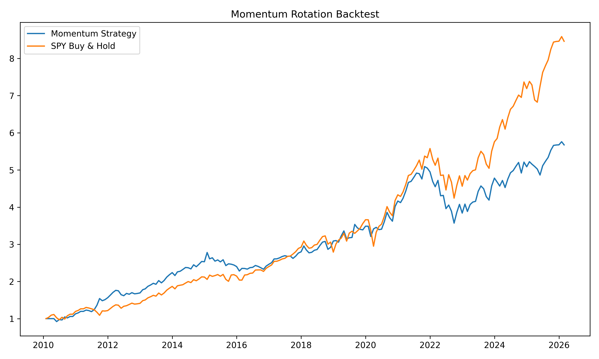

# quant-momentum-backtest
Momentum-based asset allocation strategy(SPY vs TLT) with backtesting and performance evaluation. 

# Project Overview 
This project implements a rule-based tactical asset allocation strategy using a 3-month momentum signal between: 
SPY(S&P 500 ETF, equities) 
TLT(20+ Year U.S. Treasury Bond ETF, long-term bonds) 
The objective is to evaluate whether rotating between risk-on and risk-off assets based on recent relative performance can improve risk-adjusted returns compared to a passive buy-and-hold approach. 

# Backtest Result

